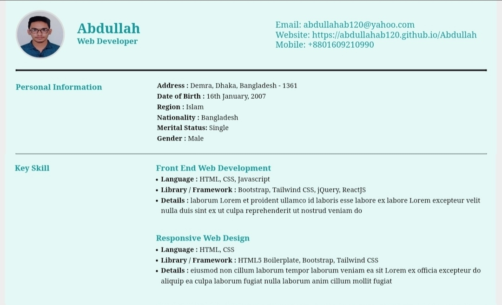
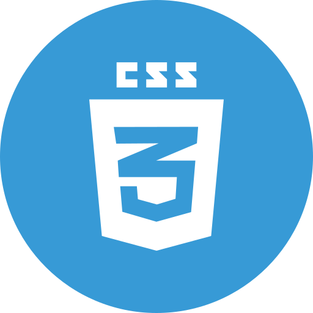

<!-- PROJECT INTRO -->

  

  <h1> Resume </h1>

  <h3> This is a simple resume </h3>
  

    <a href="https://abdullahab120.github.io/Resume"> View Demo </a>
    ·
    <a href="https://github.com/AbdullahAB120/Resume/issues/new?labels=bug&template=bug-report---.md"> Report Bug </a>
    ·
    <a href="https://github.com/AbdullahAB120/Resume/issues/new?labels=enhancement&template=feature-request---.md"> Request Feature </a>
  

 
 

<!-- ABOUT THE PROJECT -->
## About The Project

A clean and professional resume/CV website built using HTML5 and CSS3. This project was created during my early web development learning journey to practice semantic HTML, CSS styling, and structured page layouts.

### Features:
- Built with HTML5 & CSS3
- Professional Resume Layout
- Personal Information Section
- Skills & Experience Sections
- Clean & Minimal Design
- Well-Structured HTML
- Desktop-Optimized Layout

This beginner-level project helped me strengthen my understanding of HTML structure, CSS styling, and professional page design. The primary focus was on creating a clean and organized resume layout for desktop viewing using only HTML and CSS. Although it is not responsive, it reflects my early learning process and my foundation in front-end web development.

 
 

<!-- BUILT WITH -->
## Built With

 
 
 
 
 
 

 
 
<!-- CONTRIBUTING -->
## Contributing

Contributions are what make the open source community such an amazing place to learn, inspire, and create. Any contributions you make are **greatly appreciated**.

If you have a suggestion that would make this better, please fork the repo and create a pull request. You can also simply open an issue with the tag "enhancement".
Don't forget to give the project a star! Thanks again!

1. Fork the Project
2. Create your Feature Branch (`git checkout -b feature/AmazingFeature`)
3. Commit your Changes (`git commit -m 'Add some AmazingFeature'`)
4. Push to the Branch (`git push origin feature/AmazingFeature`)
5. Open a Pull Request

 
 

<!-- LICENSE -->
## License

Distributed under the MIT License. See `LICENSE.txt` for more information.

 
 

<!-- CONTACT -->
## Contact 

<a href="https://www.facebook.com/AbdullahAB120"> Facebook </a>
·
<a href="https://www.instagram.com/AbdullahAB_120"> Instagram </a>
·
<a href="https://www.linkedin.com/in/AbdullahAB120"> LinkedIn </a>
·
<a href="https://www.x.com/AbdullahAB120"> Twitter </a>
·
<a href="https://www.fiver.com/AbdullahAB120"> Fiverr </a>
